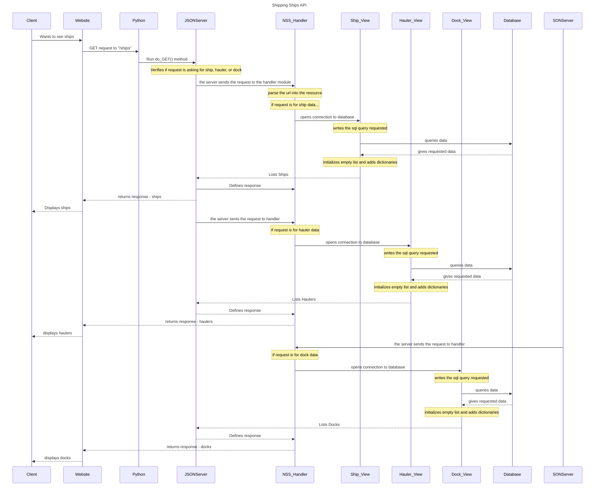

```mermaid
sequenceDiagram
  title Shipping Ships API

    participant Client
    participant Website
    participant Python
    participant JSONServer
    participant NSS_Handler
    participant Ship_View
    participant Hauler_View
    participant Dock_View
    participant Database

    
    Client ->>Website: Wants to see ships
    Website->>Python:GET request to "/ships"
    Python->>JSONServer:Run do_GET() method
    note over JSONServer: Verifies if request is asking for ship, hauler, or dock
    JSONServer->>NSS_Handler: the server sends the request to the handler module
    note over NSS_Handler:parse the url into the resource
    note over NSS_Handler: if request is for ship data...
    NSS_Handler->>Ship_View: opens connection to database
    note over Ship_View: writes the sql query requested
    Ship_View->>Database: queries data
    Database-->>Ship_View: gives requested data
    note over Ship_View: initializes empty list and adds dictionaries 
    Ship_View-->>JSONServer: Lists Ships
    JSONServer->>NSS_Handler: Defines response
    JSONServer-->>Website: returns response - ships
    Website-->>Client: Displays ships
   
   JSONServer ->>NSS_Handler: the server sents the request to handler
   note over NSS_Handler: if request is for hauler data
   NSS_Handler->>Hauler_View: opens connection to database
   note over Hauler_View: writes the sql query requested
   Hauler_View->>Database: queries data
   Database-->>Hauler_View: gives requested data
   note over Hauler_View: initializes empty list and adds dictionaries
   Hauler_View-->>JSONServer: Lists Haulers
   JSONServer-->>NSS_Handler: Defines response
   NSS_Handler-->>Website:returns response - haulers
   Website-->>Client: displays haulers
   
   SONServer ->>NSS_Handler: the server sends the request to handler
   note over NSS_Handler: if request is for dock data
   NSS_Handler->>Dock_View: opens connection to database
   note over Dock_View: writes the sql query requested
   Dock_View->>Database: queries data
   Database-->>Dock_View: gives requested data
   note over Dock_View: initializes empty list and adds dictionaries
   Dock_View-->>JSONServer: Lists Docks
   JSONServer-->>NSS_Handler: Defines response
   NSS_Handler-->>Website:returns response - docks
   Website-->>Client: displays docks


```